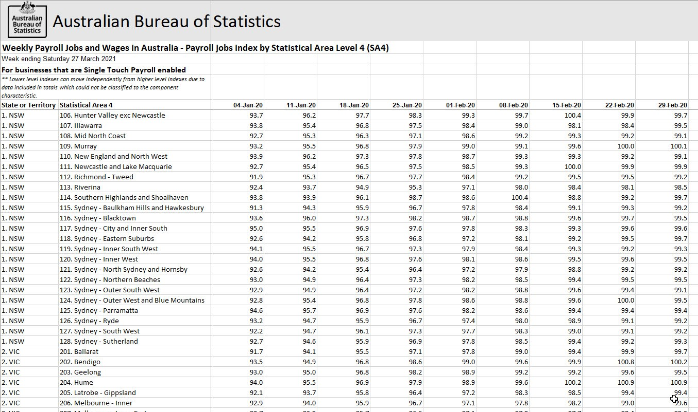

```{r setup, include=FALSE}
knitr::opts_chunk$set(echo = FALSE, output.dir='./' )

## Library load ----
# readxl to get data
library( readxl )
# lubridate for date functions
library( lubridate )
# tidyverse for general processing
library( tidyverse )
# plotly for ggplotly example
library( plotly )
# rmarkdown for reports
library( rmarkdown )
# knitr for knitting children
library( knitr )
#shiny for interactivity
library( shiny )
# leaflet for maps
library( leaflet )
# highcharter for fancy graphs
library( highcharter )
# forecast for TS forecasts
library( forecast )
# DT for tables
library( DT )
# sparkline for summary information
library( sparkline )

## Data load ----
# ASGS for SA3/SA4 access for Australian geography
# NB: I've sourced the data rather than loading the package
sa4_2016 <- ASGS::SA4_2016
# Weekly wage indices ----
# SA4
jobsSA4 <- read_excel( './jobReport.xlsx'
                       , sheet=2
                       , range='A6:BO94' ) %>%
  rename( State=1, SA4=2 ) %>%
  pivot_longer( cols=-(1:2)
                , names_to='Date'
                , values_to='Index' ) %>%
  mutate( Date=as.Date( as.numeric( Date )
                        , origin=lubridate::ymd( '1899-12-30'))) %>%
  separate( State
            , into=c('STE_CODE16', 'STE_NAME16' )
            , convert=TRUE ) %>%
  separate( SA4
            , into=c('SA4_CODE16', 'SA4_NAME16')
            , extra='merge'
            , convert=TRUE )

# State-level (derived from SA4)
jobsState <- jobsSA4 %>%
  group_by( STE_NAME16, Date ) %>%
  summarise( meanIndex=mean( Index )
             , .groups='drop' )
# Australia-wide data
jobsOz <- jobsState %>%
  group_by( STE_NAME16='Australia', Date ) %>%
  summarise( meanIndex=mean( meanIndex ), .groups='drop' )
jobsSummary <- bind_rows( jobsOz, jobsState )

# Import population data by SA4
getPopData <- function( fileName='./popSA2.xls'
                        , sheetNum
                        , skipNum=9 ){
  popData <- read_excel( fileName
                         , sheet=sheetNum
                         , skip=skipNum
                         # Only want: State code & name, SA4 Code & Name, Population 2020
                         , col_types=c('numeric' # A (State Code)
                                       , 'text'  # B (State Name)
                                       , 'skip'  # C (GCCSA Code)
                                       , 'skip'  # D (GCCSA Name)
                                       , 'numeric' # E (SA4 Code)
                                       , 'text' # F (SA4 Name)
                                       , 'skip' # G (SA3 Code)
                                       , 'skip' # H (SA3 Name)
                                       , 'skip' # I (SA2 Code)
                                       , 'skip' # J (SA2 Name)
                                       , 'skip' # K (Population 2019)
                                       , 'numeric' # L (Population 2020)
                                       , rep( 'skip', 10 ) # Skip the rest of the file.... 
                         ) 
                         # Standardise names
                         , col_names=c('STE_INDEX16'
                                       , 'STE_NAME16'
                                       , 'SA4_INDEX16'
                                       , 'SA4_NAME16'
                                       , 'Population' 
                         )
  ) %>%
    # The standard read will go off the bottom of the data to record disclaimer info
    # filter that out, as well as anything with missing info
    filter_all( all_vars( !is.na( . ) ) ) %>%
    group_by( STE_INDEX16, STE_NAME16, SA4_INDEX16, SA4_NAME16 ) %>%
    summarise( Pop=sum( Population, na.rm=TRUE ), .groups='drop' )
  
  return( popData )
}

# The data are organised by state in different sheets. 
# Map the above function to read them all...
sheetIndex <- 2:9
fullPopData <- map_dfr( sheetIndex, ~getPopData( sheetNum = . ) )
# Augment the sa4_2016 data with the population
sa4_2016@data <- left_join( sa4_2016@data, fullPopData ) 
```

## Outline

- Demonstrate different data visualisation techniques in R including:
    + `ggplot`     
    + Interactive plots (e.g. `ggplotly`, `leaflet`, `highcharter`)
    + Reporting and documentation with `rmarkdown` (including these slides!)
    + Interactive *data* with `shiny`
- Visualise impact of COVID on Australian jobs/wages
    + Data from the Australian Bureau of Statistics
    + Geographic data from the ASGS (Australian Statistical Geography Standard)
    
## Data

- ABS "Weekly Payroll Jobs and Wages in Australia" dated 27 March 20201




## Data Wrangling

- Concept of **tidy** data where:
    + Every column is a variable
    + Every row is a record
    + Every cell is a value
    + Generally the same as "long" format
- Downloaded data is not tidy - should have a column named "Date" with the current column labels as values
   + Convert with `tidyverse` verbs to put the data in long format `pivot_longer`
   + Separate number:name pairs into separate columns
   
# Plot overview

## First example: `ggplot`

- Build plots with a series of layers 
```{r ggplotExample}
firstPlot <- ggplot( data=jobsState ) +
  geom_line( aes( x=Date, y=meanIndex, colour=STE_NAME16 ) ) +
  geom_line( data=jobsOz, aes( x=Date, y=meanIndex, colour='Australia' ), colour='black', linetype=2, size=2 ) +
  labs( x='Date', y='Wage Index', title='History of wage index by state/territory' ) +
  theme( legend.position='bottom' )
firstPlot
```

## Second example: `ggplotly`

- The `ggplotly` function in the `plotly` library will fortify the graph and make it interactive

```{r ggplotlyExample}
ggplotly( firstPlot )
```

## Third example: `shiny` interactions

```{r ggplotShiny}
shinyData <- reactiveValues( forecastModel=forecast( jobsOz$meanIndex )
                             , dateRange=c(1,nrow( jobsOz ) )
                             , basePlot=NULL
                             , forecastPlot=NULL )

renderPlot({
  p1 <- ggplot( jobsOz %>% mutate( Week=row_number() ), mapping=aes( x=Week, y=meanIndex ) ) + 
    geom_line( colour='black' )
  shinyData$basePlot <- p1
  p1
},  outputArgs = list(brush = brushOpts(id = "plot_brush", direction='x' ),
                     height = "250px")
)

renderPlot({
  if( !is.null( input$plot_brush ) ){
    shinyData$dateRange=c( floor( input$plot_brush$xmin ), ceiling( input$plot_brush$xmax) )
  } else {
    shinyData$dateRange=c(1, nrow( jobsOz ) )
  }
  
  tsData <- jobsOz$meanIndex[shinyData$dateRange[1]:shinyData$dateRange[2]]
  forecastModel <- auto.arima( tsData )
  forecastData <- forecast( jobsOz$meanIndex, model=forecastModel )
  shinyData$forecastPlot <- shinyData$basePlot + 
    autolayer( forecastData, colour='grey', showgap=FALSE )
  
  shinyData$forecastPlot
}, outputArgs=list( height='250px' ) )

```

## Fourth example: `rmarkdown` publishing

```{r ggplotRmarkdown, eval=TRUE, echo=FALSE}
renderPlot({shinyData$forecastPlot}, outputArgs=list( height='400px' ) )
inputPanel( actionButton( 'go', 'Build slides!' ) )

observeEvent( input$go, render( './pptExample.Rmd'
                                , params=list( forecastPlot=shinyData$forecastPlot )
                                )
              )
```

# Maps

## Maps with `leaflet`

- Leaflet is a javascript package (`Leaflet.js`) which has an API to R.

## Step 1 & 2: Create the map

- Call to `leaflet` initialises the map

- Add polygons with `addPolygons`

```{r leaflet12, eval=TRUE}
leafletPolygon <- leaflet( sa4_2016 ) %>% 
  addPolygons( color='black'
               , weight=1
               , highlightOptions=highlightOptions( color='white', weight=2, bringToFront=TRUE ) )
renderLeaflet( leafletPolygon )
```

## Step3: Add tiles

```{r leaflet3, eval=TRUE}
leafletTile <- leaflet( sa4_2016 ) %>% 
  addTiles() %>% 
  addPolygons( color='black', weight=1
               , highlightOptions=highlightOptions( color='white'
                                                    , weight=2
                                                    , bringToFront=TRUE ) 
               , label=~paste( SA4_NAME16 ) )
renderLeaflet( leafletTile )
```


## Step 4: Augment with Jobs Data

```{r leaflet4, eval=TRUE}
sa4Data <- sa4_2016
sa4Data@data <- left_join( sa4Data@data
                           , jobsSA4 %>% 
                             filter( Date==ymd( 20200808 ) ) %>%
  select( SA4_NAME16, Date, Index )
, by='SA4_NAME16' )

leafletPal <- colorQuantile( 'RdYlGn'
                             , domain=jobsSA4$Index 
                             , n=10 )
leafletJobs <- leaflet( sa4Data ) %>% 
  addTiles() %>% 
  addPolygons( color='black', weight=1
               , highlightOptions=highlightOptions( color='white'
                                                    , weight=2
                                                    , bringToFront=TRUE ) 
               , label=~paste( SA4_NAME16, ':', round( Index ) )
               , fillColor=~leafletPal(Index) )

renderLeaflet( leafletJobs )
```

# Reporting with `rmarkdown`

## Basics

## Extra Slides

```{r results='asis', comment='', warning=FALSE, message=FALSE}
# Add a "bigCity" field to our data
jobsSA4 <- jobsSA4 %>% 
  mutate( bigCity=(startsWith( SA4_NAME16, 'Melbourne' ) |
            startsWith( SA4_NAME16 , 'Sydney') ) )

render( input='./stateExample.Rmd'
        , params=list( jobsData=jobsSA4 )
        , output_format='html_document'
        , output_file='stateExample.html' 
        , quiet=TRUE)

```

<iframe src='./stateExample.html' width='400' height='300'></iframe>

# Interactions with `shiny`

## Structure

- Component parts: UI, server (or backend), and global processing (e.g. data)
- Definition of inputs/outputs customisable
- Pre-built widgets:
    + Dropdown menus
    + Numeric inputs
    + Date inputs
- Many packages have paired Output and Render functions (e.g. `plotOutput` in UI and `renderPlot` in server)

## Example

```{r shinyLeaflet, eval=TRUE}

```

## Differences between `rmarkdown` and `shiny`

- `rmarkdown` is *pre-computed* - multiple graphs, tabs, navbars, etc. but information underlying them is static
- `shiny` allows for inputs & outputs to *dynamically* change graphs, tables, data, etc.

# Conclusions

## Data Visualisation

```{r highcharterExample}
hc1 <- hchart( sa4Data@data
        , type='scatter'
        , hcaes( x=Pop
                 , y=Index
                 , color=STE_NAME16
                 , group=STE_NAME16
                 , name=STE_NAME16 ) ) %>% 
  hc_tooltip( pointFormat=paste( '{point.SA4_NAME16} in {point.STE_NAME16}<br/> 
                                 {point.x} is the Population <br/> 
                                 {point.y} is the Job Wage Index'), valueDecimals=2 ) %>% 
  hc_legend( enabled=TRUE )

hc1
```

## Backgrounds

```{r highchartBackground}
hc1 %>% hc_chart( plotBackgroundImage='https://media.giphy.com/media/LqajRC2pU0Je8/giphy.gif'
                  , backgroundColor='black' )
```

## Pokepoints

```{r highchartPokepoints}
pokemon1 <- pokemon %>% 
  mutate( fullURL=paste0( "https://raw.githubusercontent.com/phalt/pokeapi/master/data/Pokemon_XY_Sprites/"
                          , url_image ) )

samplePokemon <- sample( pokemon1$fullURL, nrow( sa4Data@data ), replace=FALSE )

sa4Data@data$pokemarker <- samplePokemon

hcPokemon <- hchart( sa4Data@data
        , type='scatter'
        , hcaes( x=Pop
                 , y=Index
                 , color=STE_NAME16
                 , group=STE_NAME16
                 , name=STE_NAME16 )
        , marker=list( radius=0 )
        ,  dataLabels = list( 
    enabled = TRUE
    , useHTML=TRUE
    , allowOverlap=TRUE
    , format = paste( '' )
    # Move the point down to align with the point
    , y=25
    )) %>% 
  hc_tooltip( pointFormat=paste( '{point.SA4_NAME16} in {point.STE_NAME16}<br/> 
                                 {point.x} is the Population <br/> 
                                 {point.y} is the Job Wage Index <br/>
                                 '), valueDecimals=2, useHTML=TRUE ) %>% 
  hc_legend( enabled=TRUE )

hcPokemon
```